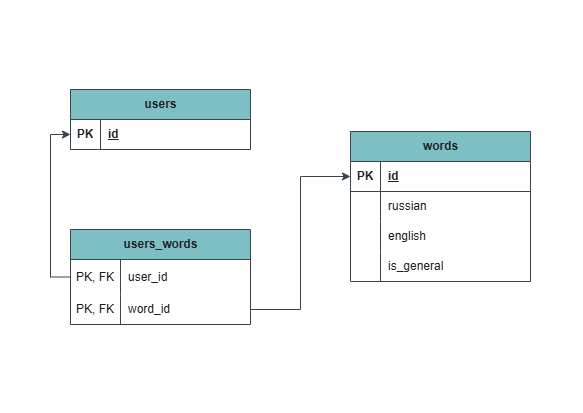

## 📚 Архитектура базы данных

Этот Telegram-бот использует реляционную базу данных PostgreSQL для хранения слов и пользователей  
Структура спроектирована так, чтобы:
- Все пользователи имели доступ к общему набору слов
- Каждый пользователь мог добавлять свои персональные слова
- Удаление слова у пользователя не влияло на других
- База данных оставалась чистой, масштабируемой и безопасной

## 🔧 Таблицы

---

### 1. `users` — пользователи бота
Хранит информацию о пользователях Telegram

| Поле | Тип      | Ограничения   | Описание                                                          |
|------|----------|---------------|-------------------------------------------------------------------|
| `id` | `BIGINT` | `PRIMARY KEY` | Уникальный `chat_id` из Telegram. Используется как первичный ключ |

---

### 2. `words` — словарь слов
Содержит все слова, как общие, так и персональные

| Поле         | Тип           | Ограничения     | Описание                                                                            |
|--------------|---------------|-----------------|-------------------------------------------------------------------------------------|
| `id`         | `SERIAL`      | `PRIMARY KEY`   | Уникальный идентификатор слова                                                      |
| `russian`    | `VARCHAR(50)` | `NOT NULL`      | Слово на русском языке                                                              |
| `english`    | `VARCHAR(50)` | `NOT NULL`      | Перевод на английский                                                               |
| `is_general` | `BOOLEAN`     | `DEFAULT FALSE` | Флаг: `TRUE` — слово общее (для всех), `FALSE` — персональное. По умолчанию `FALSE` |

---

### 3. `users_words` — связь пользователь-слово
Промежуточная таблица для отношения многие-ко-многим

| Поле      | Тип       | Описание              |
|-----------|-----------|-----------------------|
| `user_id` | `BIGINT`  | Ссылка на `users(id)` |
| `word_id` | `INTEGER` | Ссылка на `words(id)` |

**Ограничения:**
- Составной первичный ключ: `(user_id, word_id)` — гарантирует отсутствие дубликатов
- `ON DELETE CASCADE` — при удалении пользователя или слова, все связанные записи удаляются автоматически

---

## 🧩 Как это работает

### 🌐 Общие слова
- При первом запуске бота (`/start`) пользователь автоматически получает все слова с `is_general = TRUE`
- Новые общие слова можно добавить через скрипт — они появятся у всех существующих пользователей

### 🧑 Персональные слова
- Пользователь может добавить своё слово — оно сохраняется в `words` с `is_general = FALSE`
- Слово связывается с пользователем через таблицу `users_words`
- Удаление слова у одного пользователя не влияет на других